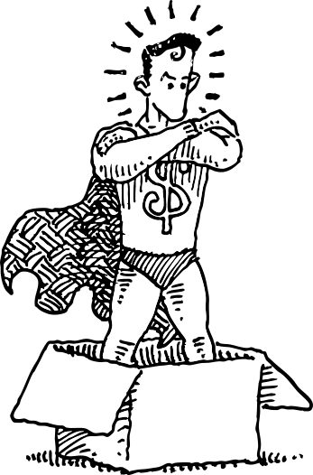

Value type
===



```csharp
[ValueType]
public partial struct MyValueType
{
    private partial ReadOnlySpan<char> Clean(ReadOnlySpan<char> value) => Helper.Clean.Trim(value);
    private partial bool ValueIsValid(ReadOnlySpan<char> value) => Helper.Validate.Default(value);
}

[ValueType<Guid>]
public partial struct MyGuidBasedValueType;
```

Code generation to generate structs wrapping internal values.
This avoids writing boilerplate code when you want strong typing of values and identities.

There are two variants; _string based_ and _struct based_

>[!NOTE]
> **Decorate a partial struct with the `ValueType` attribute.**
> The struct must be public or internal and cannot be a nested type. 
> `record struct` is not supported.

[](https://www.nuget.org/packages/Skaar.ValueType)

## Installation

```bash
dotnet add package Skaar.ValueType
```

## Usage

### Struct based

Create partial structs. Decorate with the `ValueType<T>` attribute, setting `T` to the struct/value type you want to represent..

`record struct` is not supported.
It cannot be a nested type.

The structs gets the following generated:
- A private constructor that sets the `T` value to the private field `_value`.
  Implement your own constructor if you need to set other properties, do cleaning or validation.
- Implicit conversion operator from `T` to the type itself.
- Explicit conversion operator from the type itself to `T`.
- `ToString()` implementation.
- `Equals(object)` implementation.
- `GetHashCode()` implementation.

In addition, the following interfaces are implemented, if they are implemented by `T`.
They are implemented as call through to the inner value. They mostly have explicit implementations.
Implement them on the struct if you need to provide your own logic.
- `IEquatable<U>`
- `IComparable<U>`
- `IConvertible`
- `IFormattable`
- `IParsable<U>`
- `IEqualityOperators<U, U, bool>`

They also have a `JsonConverter` that uses the inner value.

#### Example

```csharp

using Skaar.ValueType;

[ValueType<int>] 
public partial struct MyValueTypeInt;

var value = MyValueTypeInt.Parse("123");
Console.WriteLine(value); // 123
var sameValue = (MyValueTypeInt) 123;
Console.WriteLine(value == sameValue); // true
var intValue = (int) value;
```

### String based

Create partial structs. Decorate with the `ValueType` attribute.
Implement partial methods to clean and validate the value.

`record struct` is not supported.
It cannot be a nested type.

The structs are optimized for memory usage and performance.
They implement `IEquatable<T>`, `IEqualityOperators<T,T,bool>` and `ISpanParsable<T>` interfaces.
They have both type converters and json converters (`System.Text.Json`).

Convert from `string` (or `ReadOnlySpan<char>`) using `Parse` or `TryParse` methods,
or with explicit conversion.

Convert the other way using `ToString()` method or conversion.

#### Clean

```csharp
private partial ReadOnlySpan<char> Clean(ReadOnlySpan<char> value);
```

This method is called when parsing/creating the value.
It can be implemented with a helper method from `Skaar.ValueType.Helper.Clean` class.

#### Validate

```csharp
private partial bool ValueIsValid(ReadOnlySpan<char> value);
``` 

This method is called to validate the value.
It is called from the `IsValid` property and is used in parsing methods.

It can be implemented with a helper method from `Skaar.ValueType.Helper.Validate` class.

#### Example

```csharp

using Skaar.ValueType;

[ValueType]
public partial struct MyValueType
{
    private partial ReadOnlySpan<char> Clean(ReadOnlySpan<char> value) => Helper.Clean.RemoveNonDigits(value);
    private partial bool ValueIsValid(ReadOnlySpan<char> value) => Helper.Validate.IsMatch(value, new Regex(@"^\d{3}$"));
} 

var value = MyValueType.Parse("123a");
Console.WriteLine(value); // 123
value.IsValid; // true
var sameValue = MyValueType.Parse("123b");
Console.WriteLine(value == sameValue); // true
var stringValue = (string) value; // Or value.ToString();
```

#### Custom constructor

If a custom constructor is required (for instance, to set other properties),
this can be defined, and the partial generated part will omit the constructor.

The constructor must have the same signature as the generated one:

`GeneratorTestsTargetType2(ReadOnlySpan<char> value)`, and it should set 
the field `_value`. It can be private or public.

```C#
[ValueType]
public partial struct GeneratorTestsTargetType2
{
    private GeneratorTestsTargetType2(ReadOnlySpan<char> value)
    {
        _value = Clean(value).ToArray();
        WasSetInCtor = true;
    }
    private partial ReadOnlySpan<char> Clean(ReadOnlySpan<char> value) => Helper.Clean.Trim(value);
    private partial bool ValueIsValid(ReadOnlySpan<char> value) => Helper.Validate.Default(value);
    public bool WasSetInCtor { get; }
}
```